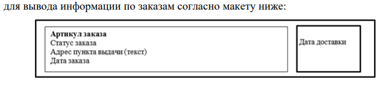

Инструкция пользователя
Для запуска нажимаете на demo.exe
Далее в окне входа вводите логин и пароль
Администратор - admin, 1 (Права - просмотр, редактирование, удаление, сортировка *товаров* и *заказов*)
Менеджер - manager, 1 (Права - просмотр, сортировка *товаров* и *заказов*)
Клиент - client, 1 (Права - просмотр *товаров* )
В системе реализованно разграничение прав доступа по ролям
ER диаграмма и sql dump приложены в папке sql

для формирования exe использовал python -m PyInstaller --noconfirm --clean --windowed --onefile --name DemoExam --add-data "resources;resources" --add-data "src/ui;src/ui" src/main.py

Задачи для codex:

er диаграмма

Сформировать алгоритм разработки приложения: оформить алгоритм в
виде блок-схемы, согласно стандарту ГОСТ 19.701-90. Документ представить
в формате .pdf.

Следует установить иконку приложения, если это реализуемо в
рамках платформы, и логотип компании на главной форме, из ресурсов

Необходимо подсвечивать строки с данными о конкретном товаре в
зависимости от размера действующей скидки. В случае если размер скидки
превышает 15%, в качестве фона необходимо применить цвет #2E8B57. Если
у товара снижена цена, то основная цена должна быть перечеркнута, цвет
шрифта красный и рядом с ней указана итоговая цена, цвет шрифта черный.
Если товара нет на складе, строка выделяется голубым цветом.

Необходимо использовать комментарии для пояснения неочевидных
фрагментов кода. Комментарии должны присутствовать только в местах,
которые требуют дополнительного пояснения. Комментарии добавь более человечные без четких знаков препинания везде

ID товара при добавлении не отображается, автоматически вычисляется
+1 к имеющемуся в БД, при редактировании ID доступно только для чтения.

Реализуйте возможность удаления товара администратором. Товар,
который присутствует в заказе, удалить нельзя.

Для
оптимального объема реализуйте ограничение на размер фото: 300Х200
пикселей.

подогнать дизайн карточки заказа под этот стиль

Все практические результаты должны быть переданы путем загрузки
файлов на предоставленный репозиторий системы контроля версий.
Практические результаты:
– исходный код приложения (структура с файлами, не архив);
– исполняемые файлы;
– файл скрипта базы данных;
– прочие графические/текстовые файлы.
Результаты работ загружать в рамках выполнения задания модуля.
